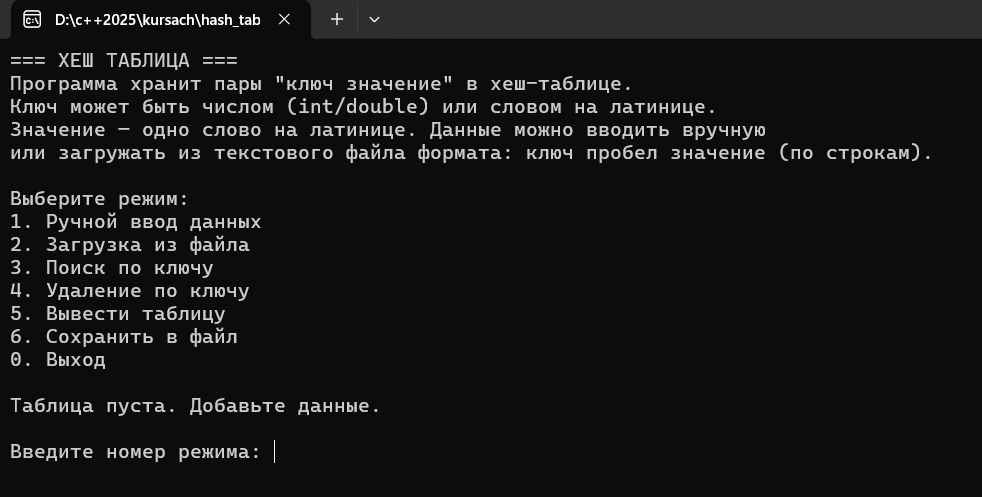
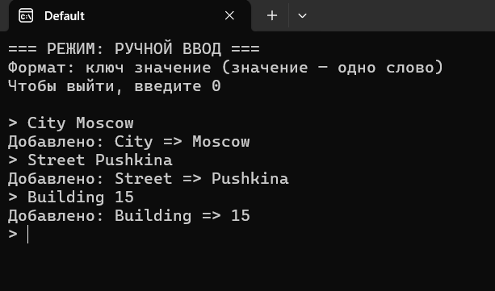
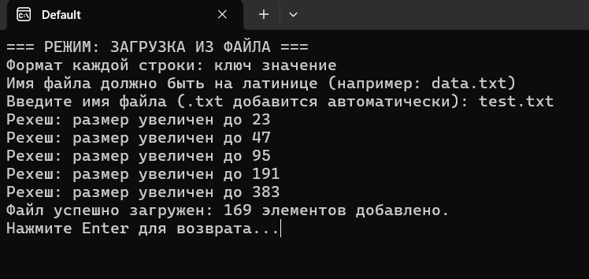
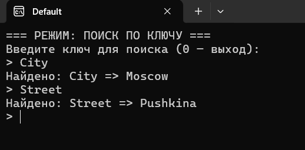
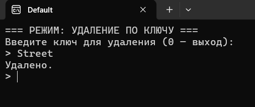
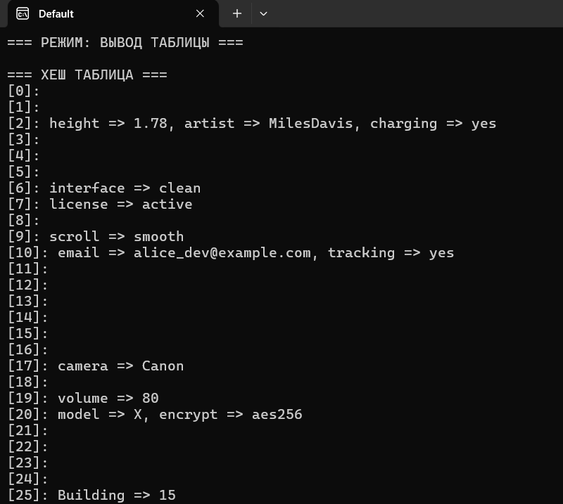
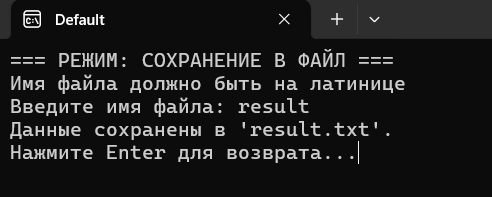

# Хеш-таблица


Консольное приложение для работы с хеш-таблицей, реализующее эффективную структуру данных для хранения пар "ключ-значение". Программа поддерживает различные типы ключей: целые числа (int), вещественные числа (double) и строки на латинице (string). 

Реализованы все основные операции: добавление элементов в таблицу, поиск значений по ключу, удаление элементов и просмотр всей таблицы. Коллизии обрабатываются методом цепочек (separate chaining), что обеспечивает корректную работу при совпадении хеш-значений. При заполнении таблицы более чем на 70% выполняется автоматическое рехеширование с увеличением размера таблицы.

Программа поддерживает работу как с ручным вводом данных через консоль, так и с загрузкой данных из текстовых файлов. Реализован экспорт хеш-таблицы в файл для последующего использования. Интерфейс программы интуитивно понятен и предоставляет все необходимые функции для работы с хеш-таблицей.

## Сборка и запуск

### Подготовка файлов

Расположите все файлы в одной папке:
- `main.cpp`
- `hash_table.cpp`
- `hash_table.h`
- `parser.cpp`
- `parser.h`
- `file_operations.cpp`
- `file_operations.h`

### Компиляция

Выполните сборку программы. Команда сборки для компилятора **MinGW**:

```bash
g++ -std=c++17 -static -static-libstdc++ -static-libgcc main.cpp hash_table.cpp parser.cpp file_operations.cpp -o hash_table_program.exe
```

### Запуск

Запустите исполняемый файл:

```bash
hash_table_program.exe
```

## Работа в программе

### Главное меню

После запуска программы на экране отобразится меню:


*Рисунок 1 - Главное меню программы*

### Заполнение хеш-таблицы

#### Ручной ввод данных

Для **ручного заполнения** хеш-таблицы выберите пункт **1** в меню.

После чего вы можете вводить данные в формате: **«ключ значение»**.

**Пример ввода данных:**


*Рисунок 2 - Пример ручного ввода данных*

Чтобы выйти из режима ручного ввода, необходимо ввести **«0»**.

#### Загрузка из файла

Для загрузки данных **из файла** необходимо выбрать пункт **2** в меню, после чего ввести название файла.


*Рисунок 3 - Загрузка данных из файла*

**Требования к файлу:**
- Файл должен находиться в одной директории с программой
- Одна строка – одна пара данных
- Формат данных: **«ключ значение»**

**Пример содержимого файла `data.txt`:**
```
apple green
42 answer
3.14 pi
name Alice
```

**Рехеширование** - автоматическое увеличение размера хеш-таблицы с пересчётом хешей при достижении **70%** заполнения.

### Поиск по ключу

Для того, чтобы найти необходимое значение по ключу, нужно выбрать пункт **3** в меню. Затем ввести ключ, и программа покажет значение этого ключа.


*Рисунок 4 - Поиск значения по ключу*

### Удаление по ключу

Для того, чтобы удалить необходимое значение по ключу, нужно выбрать пункт **4** в меню. После этого ввести ключ, и программа удалит значение и ключ.


*Рисунок 5 - Удаление элемента по ключу*

### Вывод таблицы на экран

Для того, чтобы отобразить текущую хеш-таблицу на экране нужно выбрать пункт **5** в меню. После чего в консоли отобразится хеш-таблица с индексами бакетов.


*Рисунок 6 - Вывод хеш-таблицы на экран*

### Сохранение в файл

Для того, чтобы сохранить хеш-таблицу в текстовый файл, нужно выбрать пункт **6**. Затем необходимо ввести название файла, и программа сохранит текущую хеш-таблицу в этот файл.


*Рисунок 7 - Сохранение хеш-таблицы в файл*

### Завершение работы

Для того, чтобы выйти из программы необходимо ввести **«0»** в главном меню. После этого программа завершит работу.
